```r
library(ISLR)
library(arm)
library(purrr)
library(GGally)
library(tidyverse)
```

Exercises start on page 120

##1.

Describe the null hypotheses to which the p-values given in Table 3.4
correspond. Explain what conclusions you can draw based on these
p-values. Your explanation should be phrased in terms of sales, TV,
radio, and newspaper, rather than in terms of the coefficients of the
linear model.

**Table 3.4**

|   |  Coeff | Std. error | t-statistic | p-value |
| - | ------ | ---------- | ----------- | ------- |
| Intercept | 2.9 | 0.3119 | 9.42 | < 0.0001 |
| TV | 0.05 | 0.001 | 32.81 | < 0.0001 |
| radio | 0.186 | 0.0086 | 21.89 | < 0.0001 |
| newpaper | -0.001 | 0.0059 | -0.18 | 0.8599 |

In this example, they are using the data from the advertising dataset to predict the product sales based on areas of advertising.
This table is showing the multiple regression coefficients from a model that looked something like: $sales = \beta_0 + \beta_1 \times TV +\beta_2 \times radio + \beta_3 \times newspaper + \epsilon$.

Each of the p-values is that the parameter, either `TV` or `radio` or `newspaper`, has a coefficient that equals zero - all the other parameters staying the same.
So, the null hypotheses are as follows:

- TV: the effect of TV (effect of radio and newspaper unchanged) on sales is 0
- radio: the effect of radio (effect of TV and newspaper unchanged) on sales is 0
- newspaper: the effect of newspaper (effect of radio and TV unchanged) on sales is 0

Conclusions to draw:

That for every increase in $1,000 of sales in advertising in TV, there will be an ~50 unit increase in sales.

For every $1,000 increase of sales in advertising on the radio, there will is a 186 unit increase in sales.

For every $1,000 increase of sales in advertising in newspapers, there will be no observable/meaningful change in sales.

##8. 

This question involves the use of simple linear regression on the Auto
data set.

(a) Use the lm() function to perform a simple linear regression with
mpg as the response and horsepower as the predictor. Use the
summary() function to print the results. Comment on the output.
For example:

* Is there a relationship between the predictor and the response?
* How strong is the relationship between the predictor and
the response?
* Is the relationship between the predictor and the response
positive or negative?
* What is the predicted mpg associated with a horsepower of
98? What are the associated 95% confidence and prediction
intervals?


```r
data(Auto)
head(Auto)
```

```
##   mpg cylinders displacement horsepower weight acceleration year origin
## 1  18         8          307        130   3504         12.0   70      1
## 2  15         8          350        165   3693         11.5   70      1
## 3  18         8          318        150   3436         11.0   70      1
## 4  16         8          304        150   3433         12.0   70      1
## 5  17         8          302        140   3449         10.5   70      1
## 6  15         8          429        198   4341         10.0   70      1
##                        name
## 1 chevrolet chevelle malibu
## 2         buick skylark 320
## 3        plymouth satellite
## 4             amc rebel sst
## 5               ford torino
## 6          ford galaxie 500
```


```r
Auto %>% ggplot() + geom_point(aes(x=horsepower, y=mpg))
```

<!-- -->

```r
Auto %>% ggplot() + geom_point(aes(x=horsepower, y=mpg)) + 
  facet_grid(.~year)
```

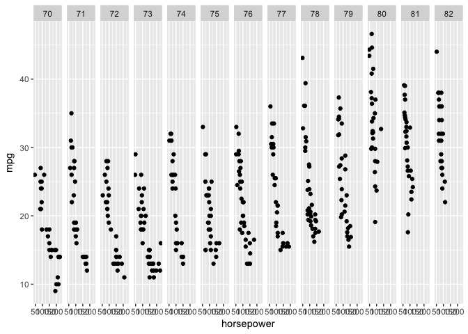<!-- -->

```r
Auto %>% ggplot() + geom_point(aes(x=horsepower, y=mpg, color=as.factor(year)))
```

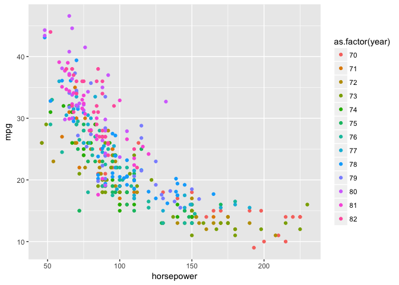<!-- -->

Looks like year also has an effect - keep in mind for improving the model in the future.


```r
fit1 <-lm(mpg ~ horsepower, data=Auto)
display(fit1)
cat("----------\n")
summary(fit1)
cat("----------\n")
summary(fit1)$sigma
cat("----------\n")
coef(fit1)
```

```
## lm(formula = mpg ~ horsepower, data = Auto)
##             coef.est coef.se
## (Intercept) 39.94     0.72  
## horsepower  -0.16     0.01  
## ---
## n = 392, k = 2
## residual sd = 4.91, R-Squared = 0.61
## ----------
## 
## Call:
## lm(formula = mpg ~ horsepower, data = Auto)
## 
## Residuals:
##      Min       1Q   Median       3Q      Max 
## -13.5710  -3.2592  -0.3435   2.7630  16.9240 
## 
## Coefficients:
##              Estimate Std. Error t value Pr(>|t|)    
## (Intercept) 39.935861   0.717499   55.66   <2e-16 ***
## horsepower  -0.157845   0.006446  -24.49   <2e-16 ***
## ---
## Signif. codes:  0 '***' 0.001 '**' 0.01 '*' 0.05 '.' 0.1 ' ' 1
## 
## Residual standard error: 4.906 on 390 degrees of freedom
## Multiple R-squared:  0.6059,	Adjusted R-squared:  0.6049 
## F-statistic: 599.7 on 1 and 390 DF,  p-value: < 2.2e-16
## 
## ----------
## [1] 4.905757
## ----------
## (Intercept)  horsepower 
##  39.9358610  -0.1578447
```

The summaries of this fit indicate that there is an overall mean mpg of 39.9, and horsepower has a -0.15 effect on the mpg. (Increase horsepower by 1, decrease mpg by 0.15).


```r
predict(fit1, newdata = data.frame(horsepower=98), interval = "confidence")
predict(fit1, newdata = data.frame(horsepower=98), interval = "prediction")
```

```
##        fit      lwr      upr
## 1 24.46708 23.97308 24.96108
##        fit     lwr      upr
## 1 24.46708 14.8094 34.12476
```

Why are they different? 

* Confidence interval - confidence that the true mean is in the interval of what the estimate was. generally, what is the mpg for engines of X horsepower
* Prediction interval - any one engine with 89 horsepower, the error is larger? Over what range do we expect that engine to lie for a given horsepower.

(b) Plot the response and the predictor. Use the abline() function
to display the least squares regression line.


```r
Auto %>% ggplot() + geom_point(aes(x=horsepower, y=mpg)) +
  geom_abline(intercept = coef(fit1)[1], slope = coef(fit1)[2]) + 
  ylim(0, 45)
```

```
## Warning: Removed 1 rows containing missing values (geom_point).
```

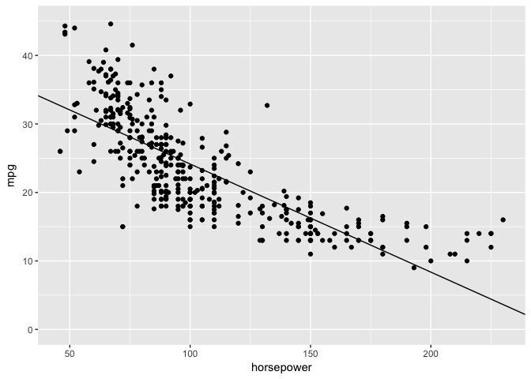<!-- -->

```r
Auto %>% ggplot(aes(x=horsepower, y=mpg)) + geom_point() +
  geom_smooth(method="lm")
```

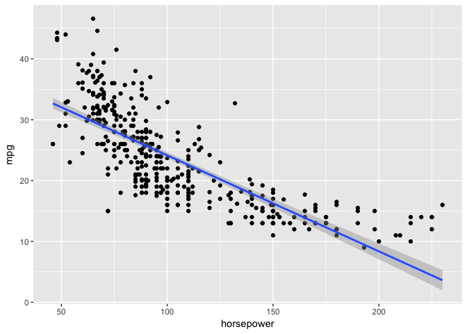<!-- -->

```r
#Auto %>% ggplot(aes(x=horsepower, y=mpg)) + geom_point() + geom_smooth(method="lm", formula = mpg ~ horsepower + year)
```

centering the data


```r
auto <- Auto %>% mutate(horsepower_centered=horsepower - mean(horsepower))
auto %>% ggplot() + geom_point(aes(x=horsepower, y=log(mpg)))
```

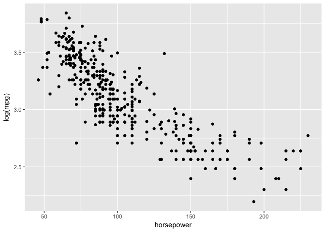<!-- -->


(c) Use the plot() function to produce diagnostic plots of the least
squares regression fit. Comment on any problems you see with
the fit.


```r
plot(fit1)
```

<!-- -->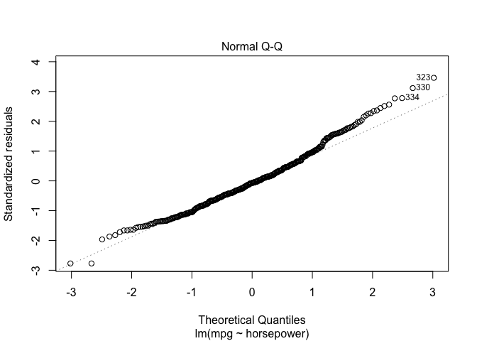<!-- --><!-- -->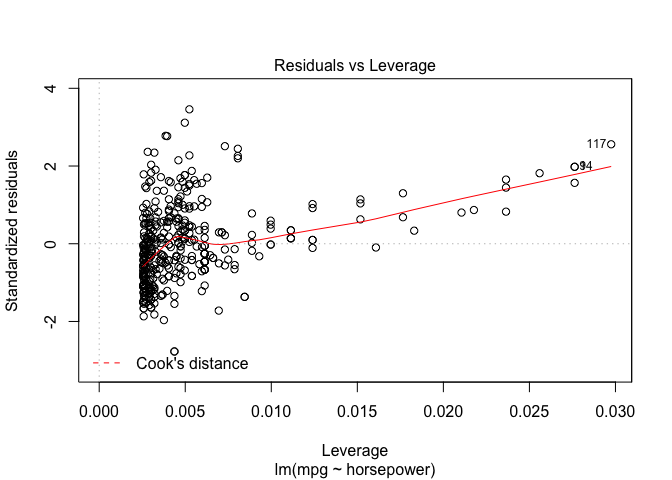<!-- -->

In the residual plot, small and large effect have residuals that deviate from the null residual of 0, indicating non-linearity (which we can see when we plot).
Here, the Q-Q plot seems to indicate that the model has trouble with fitting the upper quantile of the data.
Some data points have a higher leverage compared to a majority of the data - but nothing is too far out of the model for concern.
Also - the range of leverage here is very small. Does that matter? As opposed to the examples in the book, which range up to 3.

## 9.

This question involves the use of multiple linear regression on the
Auto data set.


```r
data("Auto")
head(Auto)
```

```
##   mpg cylinders displacement horsepower weight acceleration year origin
## 1  18         8          307        130   3504         12.0   70      1
## 2  15         8          350        165   3693         11.5   70      1
## 3  18         8          318        150   3436         11.0   70      1
## 4  16         8          304        150   3433         12.0   70      1
## 5  17         8          302        140   3449         10.5   70      1
## 6  15         8          429        198   4341         10.0   70      1
##                        name
## 1 chevrolet chevelle malibu
## 2         buick skylark 320
## 3        plymouth satellite
## 4             amc rebel sst
## 5               ford torino
## 6          ford galaxie 500
```

**(a)**


```r
ggscatmat(Auto, columns=1:9)
```

```
## Warning in ggscatmat(Auto, columns = 1:9): Factor variables are omitted in
## plot
```

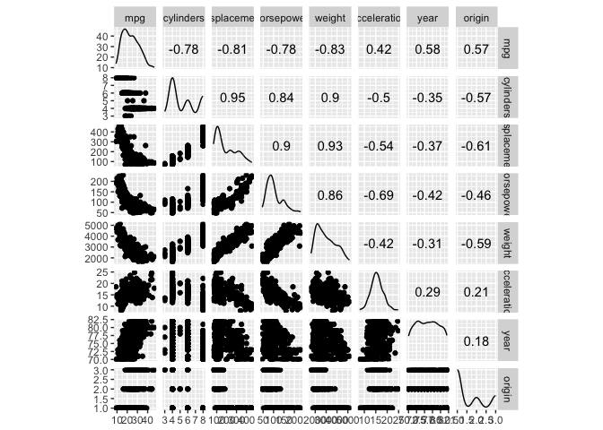<!-- -->

**b**


```r
auto_cor <- Auto %>% select(-name) %>% cor()
auto_cor
```

```
##                     mpg  cylinders displacement horsepower     weight
## mpg           1.0000000 -0.7776175   -0.8051269 -0.7784268 -0.8322442
## cylinders    -0.7776175  1.0000000    0.9508233  0.8429834  0.8975273
## displacement -0.8051269  0.9508233    1.0000000  0.8972570  0.9329944
## horsepower   -0.7784268  0.8429834    0.8972570  1.0000000  0.8645377
## weight       -0.8322442  0.8975273    0.9329944  0.8645377  1.0000000
## acceleration  0.4233285 -0.5046834   -0.5438005 -0.6891955 -0.4168392
## year          0.5805410 -0.3456474   -0.3698552 -0.4163615 -0.3091199
## origin        0.5652088 -0.5689316   -0.6145351 -0.4551715 -0.5850054
##              acceleration       year     origin
## mpg             0.4233285  0.5805410  0.5652088
## cylinders      -0.5046834 -0.3456474 -0.5689316
## displacement   -0.5438005 -0.3698552 -0.6145351
## horsepower     -0.6891955 -0.4163615 -0.4551715
## weight         -0.4168392 -0.3091199 -0.5850054
## acceleration    1.0000000  0.2903161  0.2127458
## year            0.2903161  1.0000000  0.1815277
## origin          0.2127458  0.1815277  1.0000000
```


**(c)** Use the lm() function to perform a multiple linear regression
with mpg as the response and all other variables except name as
the predictors. Use the summary() function to print the results.
Comment on the output.


```r
auto <- Auto %>% select(-name)
auto_fit <- lm(mpg ~ ., data=auto)
summary(auto_fit)
```

```
## 
## Call:
## lm(formula = mpg ~ ., data = auto)
## 
## Residuals:
##     Min      1Q  Median      3Q     Max 
## -9.5903 -2.1565 -0.1169  1.8690 13.0604 
## 
## Coefficients:
##                Estimate Std. Error t value Pr(>|t|)    
## (Intercept)  -17.218435   4.644294  -3.707  0.00024 ***
## cylinders     -0.493376   0.323282  -1.526  0.12780    
## displacement   0.019896   0.007515   2.647  0.00844 ** 
## horsepower    -0.016951   0.013787  -1.230  0.21963    
## weight        -0.006474   0.000652  -9.929  < 2e-16 ***
## acceleration   0.080576   0.098845   0.815  0.41548    
## year           0.750773   0.050973  14.729  < 2e-16 ***
## origin         1.426141   0.278136   5.127 4.67e-07 ***
## ---
## Signif. codes:  0 '***' 0.001 '**' 0.01 '*' 0.05 '.' 0.1 ' ' 1
## 
## Residual standard error: 3.328 on 384 degrees of freedom
## Multiple R-squared:  0.8215,	Adjusted R-squared:  0.8182 
## F-statistic: 252.4 on 7 and 384 DF,  p-value: < 2.2e-16
```

Predictors with significant relationship to mpg: 

- displacement
- weight
- year 
- origin

for it, there is an increase of 0.75 miles per gallon for each year gained, all other predictors being equal


```r
Auto %>% ggplot(aes(x=year, y=mpg)) + geom_point()
```

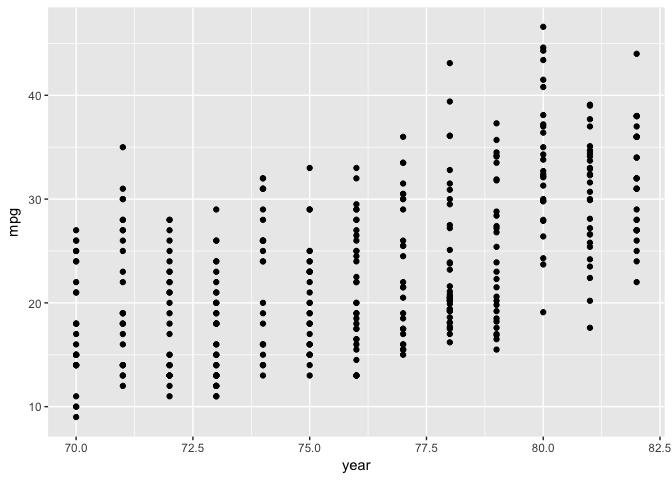<!-- -->

**d**


```r
plot(auto_fit)
```

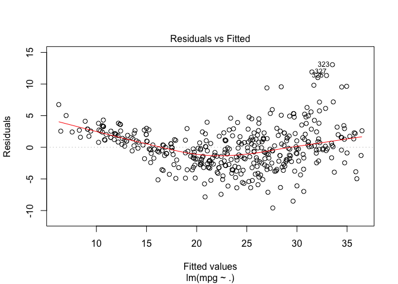<!-- -->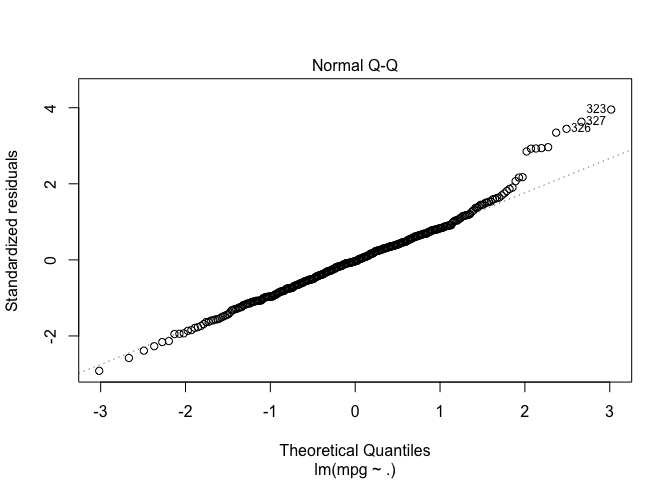<!-- -->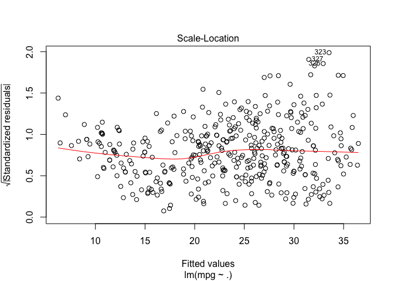<!-- -->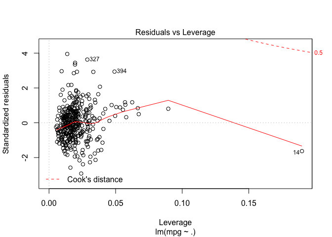<!-- -->

The `residuals vs Fitted` plot and the Q-Q plot suggest non-perfect fits.

Leverage:


```r
#which observation has the largest leverage
which.max(hatvalues(auto_fit))
```

```
## 14 
## 14
```

```r
auto[14,]
```

```
##    mpg cylinders displacement horsepower weight acceleration year origin
## 14  14         8          455        225   3086           10   70      1
```

Observation in row 14 has a super high leverage value. This indicates that the predictor values for this car hare relatively large compared to other predictor values.


```r
AIC(auto_fit)
```

```
## [1] 2064.949
```


**e**

Create some interaction models...


```r
summary(lm(mpg ~ year*horsepower , data=auto))
```

```
## 
## Call:
## lm(formula = mpg ~ year * horsepower, data = auto)
## 
## Residuals:
##      Min       1Q   Median       3Q      Max 
## -12.3492  -2.4509  -0.4557   2.4056  14.4437 
## 
## Coefficients:
##                   Estimate Std. Error t value Pr(>|t|)    
## (Intercept)     -1.266e+02  1.212e+01 -10.449   <2e-16 ***
## year             2.192e+00  1.613e-01  13.585   <2e-16 ***
## horsepower       1.046e+00  1.154e-01   9.063   <2e-16 ***
## year:horsepower -1.596e-02  1.562e-03 -10.217   <2e-16 ***
## ---
## Signif. codes:  0 '***' 0.001 '**' 0.01 '*' 0.05 '.' 0.1 ' ' 1
## 
## Residual standard error: 3.901 on 388 degrees of freedom
## Multiple R-squared:  0.7522,	Adjusted R-squared:  0.7503 
## F-statistic: 392.5 on 3 and 388 DF,  p-value: < 2.2e-16
```


```r
summary(lm(mpg ~ acceleration + year + acceleration*year, data=auto))
```

```
## 
## Call:
## lm(formula = mpg ~ acceleration + year + acceleration * year, 
##     data = auto)
## 
## Residuals:
##      Min       1Q   Median       3Q      Max 
## -11.9341  -4.9339  -0.6187   4.7066  18.0828 
## 
## Coefficients:
##                    Estimate Std. Error t value Pr(>|t|)   
## (Intercept)       -89.41449   34.07514  -2.624  0.00903 **
## acceleration        2.09675    2.17707   0.963  0.33609   
## year                1.32728    0.45386   2.924  0.00365 **
## acceleration:year  -0.01738    0.02885  -0.602  0.54727   
## ---
## Signif. codes:  0 '***' 0.001 '**' 0.01 '*' 0.05 '.' 0.1 ' ' 1
## 
## Residual standard error: 6.026 on 388 degrees of freedom
## Multiple R-squared:  0.4085,	Adjusted R-squared:  0.4039 
## F-statistic: 89.31 on 3 and 388 DF,  p-value: < 2.2e-16
```

Acceleration and year do not have a significant interaction term together.


```r
summary(lm(mpg ~ year + origin, data=auto))
```

```
## 
## Call:
## lm(formula = mpg ~ year + origin, data = auto)
## 
## Residuals:
##      Min       1Q   Median       3Q      Max 
## -11.3126  -3.7257  -0.4732   3.3893  15.5874 
## 
## Coefficients:
##              Estimate Std. Error t value Pr(>|t|)    
## (Intercept) -63.37982    5.46818  -11.59   <2e-16 ***
## year          1.04715    0.07282   14.38   <2e-16 ***
## origin        4.60725    0.33301   13.84   <2e-16 ***
## ---
## Signif. codes:  0 '***' 0.001 '**' 0.01 '*' 0.05 '.' 0.1 ' ' 1
## 
## Residual standard error: 5.216 on 389 degrees of freedom
## Multiple R-squared:  0.5557,	Adjusted R-squared:  0.5534 
## F-statistic: 243.2 on 2 and 389 DF,  p-value: < 2.2e-16
```


```r
summary(lm(mpg ~ year + origin + horsepower, data=auto))
```

```
## 
## Call:
## lm(formula = mpg ~ year + origin + horsepower, data = auto)
## 
## Residuals:
##     Min      1Q  Median      3Q     Max 
## -9.7541 -2.5992 -0.3083  2.0746 12.5700 
## 
## Coefficients:
##               Estimate Std. Error t value Pr(>|t|)    
## (Intercept) -19.887543   4.902781  -4.056 6.03e-05 ***
## year          0.662779   0.059987  11.049  < 2e-16 ***
## origin        2.607941   0.280121   9.310  < 2e-16 ***
## horsepower   -0.106593   0.006341 -16.811  < 2e-16 ***
## ---
## Signif. codes:  0 '***' 0.001 '**' 0.01 '*' 0.05 '.' 0.1 ' ' 1
## 
## Residual standard error: 3.973 on 388 degrees of freedom
## Multiple R-squared:  0.7429,	Adjusted R-squared:  0.7409 
## F-statistic: 373.8 on 3 and 388 DF,  p-value: < 2.2e-16
```

```r
summary(lm(mpg ~ year + origin + horsepower + origin*horsepower, data=auto))
```

```
## 
## Call:
## lm(formula = mpg ~ year + origin + horsepower + origin * horsepower, 
##     data = auto)
## 
## Residuals:
##    Min     1Q Median     3Q    Max 
## -9.422 -2.667 -0.445  1.878 11.907 
## 
## Coefficients:
##                    Estimate Std. Error t value Pr(>|t|)    
## (Intercept)       -26.82389    4.86767  -5.511 6.54e-08 ***
## year                0.66625    0.05768  11.550  < 2e-16 ***
## origin              8.01676    0.98362   8.150 5.09e-15 ***
## horsepower         -0.03097    0.01456  -2.127   0.0341 *  
## origin:horsepower  -0.06476    0.01133  -5.717 2.16e-08 ***
## ---
## Signif. codes:  0 '***' 0.001 '**' 0.01 '*' 0.05 '.' 0.1 ' ' 1
## 
## Residual standard error: 3.82 on 387 degrees of freedom
## Multiple R-squared:  0.7629,	Adjusted R-squared:  0.7605 
## F-statistic: 311.4 on 4 and 387 DF,  p-value: < 2.2e-16
```

The interaction term only increases the R^2 by 0.02...


```r
anova(lm(mpg ~ year + origin + horsepower, data=auto), lm(mpg ~ year + origin + horsepower + origin*horsepower, data=auto))
```

```
## Analysis of Variance Table
## 
## Model 1: mpg ~ year + origin + horsepower
## Model 2: mpg ~ year + origin + horsepower + origin * horsepower
##   Res.Df    RSS Df Sum of Sq      F    Pr(>F)    
## 1    388 6123.2                                  
## 2    387 5646.3  1    476.92 32.688 2.165e-08 ***
## ---
## Signif. codes:  0 '***' 0.001 '**' 0.01 '*' 0.05 '.' 0.1 ' ' 1
```

```r
AIC(lm(mpg ~ year + origin + horsepower, data=auto), lm(mpg ~ year + origin + horsepower + origin*horsepower, data=auto))
```

```
##                                                                         df
## lm(mpg ~ year + origin + horsepower, data = auto)                        5
## lm(mpg ~ year + origin + horsepower + origin * horsepower, data = auto)  6
##                                                                              AIC
## lm(mpg ~ year + origin + horsepower, data = auto)                       2199.893
## lm(mpg ~ year + origin + horsepower + origin * horsepower, data = auto) 2170.107
```
 looking at the result of the anova, and at the AIC, it indicates that these are two very different models.

**f**


```r
summary(lm(mpg ~ horsepower, data=auto))
```

```
## 
## Call:
## lm(formula = mpg ~ horsepower, data = auto)
## 
## Residuals:
##      Min       1Q   Median       3Q      Max 
## -13.5710  -3.2592  -0.3435   2.7630  16.9240 
## 
## Coefficients:
##              Estimate Std. Error t value Pr(>|t|)    
## (Intercept) 39.935861   0.717499   55.66   <2e-16 ***
## horsepower  -0.157845   0.006446  -24.49   <2e-16 ***
## ---
## Signif. codes:  0 '***' 0.001 '**' 0.01 '*' 0.05 '.' 0.1 ' ' 1
## 
## Residual standard error: 4.906 on 390 degrees of freedom
## Multiple R-squared:  0.6059,	Adjusted R-squared:  0.6049 
## F-statistic: 599.7 on 1 and 390 DF,  p-value: < 2.2e-16
```

```r
cat("-------------------------------------------\n")
```

```
## -------------------------------------------
```

```r
summary(lm(mpg ~ horsepower + I(horsepower^2), data=auto))
```

```
## 
## Call:
## lm(formula = mpg ~ horsepower + I(horsepower^2), data = auto)
## 
## Residuals:
##      Min       1Q   Median       3Q      Max 
## -14.7135  -2.5943  -0.0859   2.2868  15.8961 
## 
## Coefficients:
##                   Estimate Std. Error t value Pr(>|t|)    
## (Intercept)     56.9000997  1.8004268   31.60   <2e-16 ***
## horsepower      -0.4661896  0.0311246  -14.98   <2e-16 ***
## I(horsepower^2)  0.0012305  0.0001221   10.08   <2e-16 ***
## ---
## Signif. codes:  0 '***' 0.001 '**' 0.01 '*' 0.05 '.' 0.1 ' ' 1
## 
## Residual standard error: 4.374 on 389 degrees of freedom
## Multiple R-squared:  0.6876,	Adjusted R-squared:  0.686 
## F-statistic:   428 on 2 and 389 DF,  p-value: < 2.2e-16
```

```r
cat("-------------------------------------------\n")
```

```
## -------------------------------------------
```

```r
summary(lm(mpg ~ horsepower + log(horsepower), data=auto))
```

```
## 
## Call:
## lm(formula = mpg ~ horsepower + log(horsepower), data = auto)
## 
## Residuals:
##      Min       1Q   Median       3Q      Max 
## -14.5118  -2.5018  -0.2533   2.4446  15.3102 
## 
## Coefficients:
##                  Estimate Std. Error t value Pr(>|t|)    
## (Intercept)     156.04057   12.08267  12.914  < 2e-16 ***
## horsepower        0.11846    0.02929   4.044 6.34e-05 ***
## log(horsepower) -31.59815    3.28363  -9.623  < 2e-16 ***
## ---
## Signif. codes:  0 '***' 0.001 '**' 0.01 '*' 0.05 '.' 0.1 ' ' 1
## 
## Residual standard error: 4.415 on 389 degrees of freedom
## Multiple R-squared:  0.6817,	Adjusted R-squared:  0.6801 
## F-statistic: 416.6 on 2 and 389 DF,  p-value: < 2.2e-16
```


```r
auto %>% ggplot(aes(x=horsepower, y=mpg)) + geom_point() + geom_smooth(formula = y ~ x, method = "lm")
```

<!-- -->

```r
auto %>% ggplot(aes(x=log(horsepower), y=mpg)) + geom_point() + geom_smooth(formula = y ~ log(x), method = "lm")
```

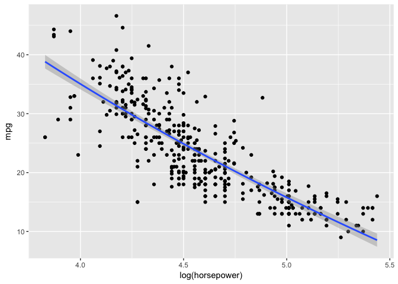<!-- -->

```r
auto %>% ggplot(aes(x=horsepower**2, y=mpg)) + geom_point() + geom_smooth(formula = y ~ poly(x, 2), method = "lm")
```

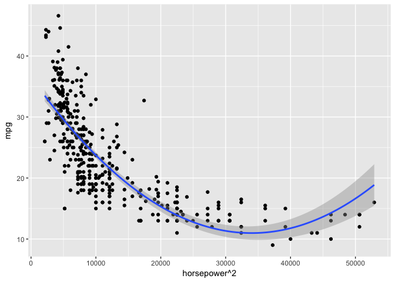<!-- -->

For a multi-variate model

```r
summary(lm(mpg ~ origin + horsepower, data=auto))
```

```
## 
## Call:
## lm(formula = mpg ~ origin + horsepower, data = auto)
## 
## Residuals:
##      Min       1Q   Median       3Q      Max 
## -11.2879  -3.3796  -0.5575   2.5028  14.2242 
## 
## Coefficients:
##              Estimate Std. Error t value Pr(>|t|)    
## (Intercept) 33.307665   1.059736  31.430  < 2e-16 ***
## origin       2.577402   0.320749   8.036 1.13e-14 ***
## horsepower  -0.133294   0.006712 -19.858  < 2e-16 ***
## ---
## Signif. codes:  0 '***' 0.001 '**' 0.01 '*' 0.05 '.' 0.1 ' ' 1
## 
## Residual standard error: 4.549 on 389 degrees of freedom
## Multiple R-squared:  0.662,	Adjusted R-squared:  0.6603 
## F-statistic:   381 on 2 and 389 DF,  p-value: < 2.2e-16
```

```r
cat("-------------------------------------------\n")
```

```
## -------------------------------------------
```

```r
summary(lm(mpg ~ origin + horsepower + I(horsepower^2), data=auto))
```

```
## 
## Call:
## lm(formula = mpg ~ origin + horsepower + I(horsepower^2), data = auto)
## 
## Residuals:
##      Min       1Q   Median       3Q      Max 
## -12.7765  -2.5654  -0.1114   2.1967  13.3190 
## 
## Coefficients:
##                   Estimate Std. Error t value Pr(>|t|)    
## (Intercept)     49.4126946  2.0372214  24.255  < 2e-16 ***
## origin           2.0106108  0.2989809   6.725 6.31e-11 ***
## horsepower      -0.4049269  0.0308681 -13.118  < 2e-16 ***
## I(horsepower^2)  0.0010625  0.0001183   8.978  < 2e-16 ***
## ---
## Signif. codes:  0 '***' 0.001 '**' 0.01 '*' 0.05 '.' 0.1 ' ' 1
## 
## Residual standard error: 4.145 on 388 degrees of freedom
## Multiple R-squared:  0.7202,	Adjusted R-squared:  0.718 
## F-statistic: 332.9 on 3 and 388 DF,  p-value: < 2.2e-16
```

```r
cat("-------------------------------------------\n")
```

```
## -------------------------------------------
```

```r
summary(lm(mpg ~ origin + horsepower + log(horsepower), data=auto))
```

```
## 
## Call:
## lm(formula = mpg ~ origin + horsepower + log(horsepower), data = auto)
## 
## Residuals:
##      Min       1Q   Median       3Q      Max 
## -13.1253  -2.5315  -0.3154   2.2423  13.7133 
## 
## Coefficients:
##                  Estimate Std. Error t value Pr(>|t|)    
## (Intercept)     134.28666   11.88274  11.301  < 2e-16 ***
## origin            2.04147    0.30136   6.774 4.66e-11 ***
## horsepower        0.09863    0.02789   3.536 0.000455 ***
## log(horsepower) -27.10656    3.17905  -8.527 3.40e-16 ***
## ---
## Signif. codes:  0 '***' 0.001 '**' 0.01 '*' 0.05 '.' 0.1 ' ' 1
## 
## Residual standard error: 4.18 on 388 degrees of freedom
## Multiple R-squared:  0.7154,	Adjusted R-squared:  0.7132 
## F-statistic: 325.1 on 3 and 388 DF,  p-value: < 2.2e-16
```


```r
auto %>% ggplot(aes(x=horsepower, y=mpg)) + geom_point() + geom_smooth(formula = y ~ x, method = "lm")
```

<!-- -->

```r
auto %>% ggplot(aes(x=log(horsepower), y=mpg)) + geom_point() + geom_smooth(formula = y ~ log(x), method = "lm")
```

<!-- -->

```r
auto %>% ggplot(aes(x=horsepower**2, y=mpg)) + geom_point() + geom_smooth(formula = y ~ poly(x, 2), method = "lm")
```

<!-- -->

# 10.


```r
data("Carseats")
```

Price: price company charges ofr car seats at each site
Urban: factor, yes or no, where the stor in at an urban or rural loaction
US: yes or no for in the US or not.

Fit multiple regression model


```r
carseat_fit <- lm(Sales ~ Price + Urban + US, data=Carseats)
summary(carseat_fit)
```

```
## 
## Call:
## lm(formula = Sales ~ Price + Urban + US, data = Carseats)
## 
## Residuals:
##     Min      1Q  Median      3Q     Max 
## -6.9206 -1.6220 -0.0564  1.5786  7.0581 
## 
## Coefficients:
##              Estimate Std. Error t value Pr(>|t|)    
## (Intercept) 13.043469   0.651012  20.036  < 2e-16 ***
## Price       -0.054459   0.005242 -10.389  < 2e-16 ***
## UrbanYes    -0.021916   0.271650  -0.081    0.936    
## USYes        1.200573   0.259042   4.635 4.86e-06 ***
## ---
## Signif. codes:  0 '***' 0.001 '**' 0.01 '*' 0.05 '.' 0.1 ' ' 1
## 
## Residual standard error: 2.472 on 396 degrees of freedom
## Multiple R-squared:  0.2393,	Adjusted R-squared:  0.2335 
## F-statistic: 41.52 on 3 and 396 DF,  p-value: < 2.2e-16
```


```r
contrasts(Carseats$Urban)
```

```
##     Yes
## No    0
## Yes   1
```

```r
contrasts(Carseats$US)
```

```
##     Yes
## No    0
## Yes   1
```

**b**

Here, `Price` has a significant and negative effect of carseat sales.

For `Urban`, there is no difference between sales between urban and rural areas. This indicates that there is a carseats are higher in the US relative to outside the US. (being in the US is better for selling carseats by these companies.)

However, there is a significant and positive effect of of `US`, meaning that 

**c**

$$Sales = \beta_0 + \beta_1 + \epsilon =  \left\{ \begin{array}{lr} \beta_0 + \beta_1 + \epsilon_i \\ \beta_0 + \epsilon_i \end{array} \right.$$

Where the bottom equation occurs if the car seat sales are occuring in the US.

**d**

reject for price and US


**e**


```r
carseat_fit2 <- lm(Sales ~ Price + US, data=Carseats)
summary(carseat_fit2)
```

```
## 
## Call:
## lm(formula = Sales ~ Price + US, data = Carseats)
## 
## Residuals:
##     Min      1Q  Median      3Q     Max 
## -6.9269 -1.6286 -0.0574  1.5766  7.0515 
## 
## Coefficients:
##             Estimate Std. Error t value Pr(>|t|)    
## (Intercept) 13.03079    0.63098  20.652  < 2e-16 ***
## Price       -0.05448    0.00523 -10.416  < 2e-16 ***
## USYes        1.19964    0.25846   4.641 4.71e-06 ***
## ---
## Signif. codes:  0 '***' 0.001 '**' 0.01 '*' 0.05 '.' 0.1 ' ' 1
## 
## Residual standard error: 2.469 on 397 degrees of freedom
## Multiple R-squared:  0.2393,	Adjusted R-squared:  0.2354 
## F-statistic: 62.43 on 2 and 397 DF,  p-value: < 2.2e-16
```

**f**


```r
anova(carseat_fit, carseat_fit2)
```

```
## Analysis of Variance Table
## 
## Model 1: Sales ~ Price + Urban + US
## Model 2: Sales ~ Price + US
##   Res.Df    RSS Df Sum of Sq      F Pr(>F)
## 1    396 2420.8                           
## 2    397 2420.9 -1  -0.03979 0.0065 0.9357
```


**h**


```r
plot(carseat_fit2)
```

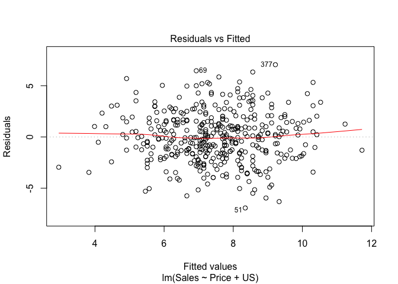<!-- -->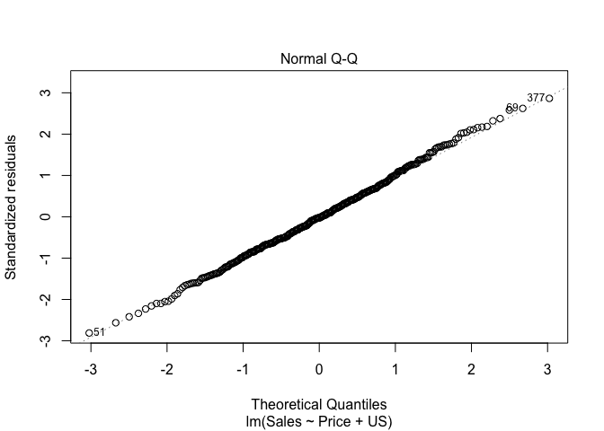<!-- -->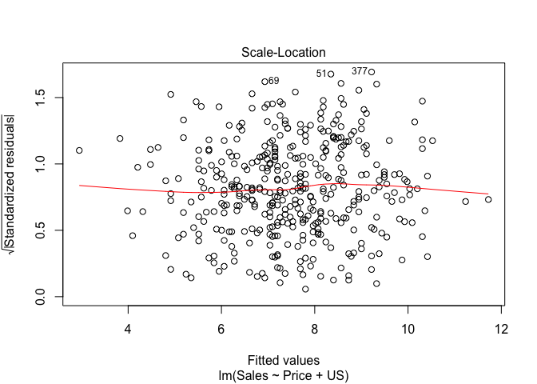<!-- -->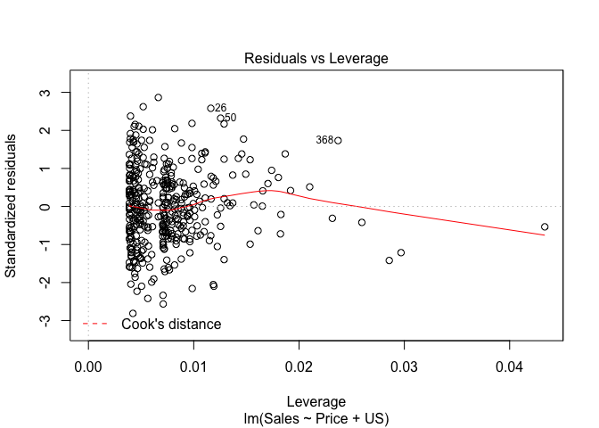<!-- -->

```r
which.max(hatvalues(carseat_fit2))
```

```
## 43 
## 43
```


```r
Carseats[which.max(hatvalues(carseat_fit2)),]
```

```
##    Sales CompPrice Income Advertising Population Price ShelveLoc Age
## 43 10.43        77     69           0         25    24    Medium  50
##    Education Urban US
## 43        18   Yes No
```


```r
plot(hatvalues(carseat_fit2))
```

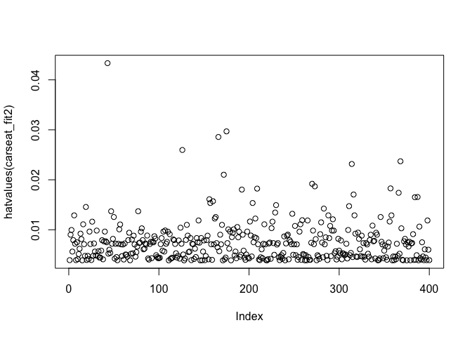<!-- -->

There is one point with higher leverage than the rest of the dataset.

## 13. 

In this exercise you will create some simulated data and will fit simple
linear regression models to it. Make sure to use set.seed(1) prior to
starting part (a) to ensure consistent results.

(a) Using the rnorm() function, create a vector, x, containing 100
observations drawn from a N(0, 1) distribution. This represents
a feature, X.


```r
set.seed(1)
x <- rnorm(1:100, mean=0, sd=1)
```


(b) Using the rnorm() function, create a vector, eps, containing 100
observations drawn from a N(0, 0.25) distribution i.e. a normal
distribution with mean zero and variance 0.25.


```r
eps <- rnorm(1:100, mean=0, sd=sqrt(0.25))
```


(c) Using x and eps, generate a vector y according to the model
$$Y = −1 + 0.5X + \epsilon  \space (3.39)$$

What is the length of the vector y? What are the values of β0
and β1 in this linear model?


```r
y <- -1 + 0.5*x + eps
length(y)
```

```
## [1] 100
```

Here, $\beta_0$ is -1, and $\beta_1$ is 0.5

(d) Create a scatterplot displaying the relationship between x and
y. Comment on what you observe.


```r
plot(x,y)
abline(a = -1, b = 0.5)
```

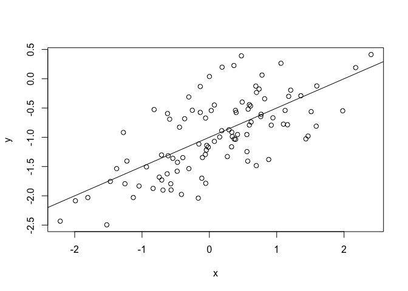<!-- -->


(e) Fit a least squares linear model to predict y using x. Comment
on the model obtained. How do ˆ β0 and ˆ β1 compare to β0 and
β1?


```r
fit13e <- lm(y~x)
display(fit13e)
```

```
## lm(formula = y ~ x)
##             coef.est coef.se
## (Intercept) -1.02     0.05  
## x            0.50     0.05  
## ---
## n = 100, k = 2
## residual sd = 0.48, R-Squared = 0.47
```

```r
summary(fit13e)
```

```
## 
## Call:
## lm(formula = y ~ x)
## 
## Residuals:
##      Min       1Q   Median       3Q      Max 
## -0.93842 -0.30688 -0.06975  0.26970  1.17309 
## 
## Coefficients:
##             Estimate Std. Error t value Pr(>|t|)    
## (Intercept) -1.01885    0.04849 -21.010  < 2e-16 ***
## x            0.49947    0.05386   9.273 4.58e-15 ***
## ---
## Signif. codes:  0 '***' 0.001 '**' 0.01 '*' 0.05 '.' 0.1 ' ' 1
## 
## Residual standard error: 0.4814 on 98 degrees of freedom
## Multiple R-squared:  0.4674,	Adjusted R-squared:  0.4619 
## F-statistic: 85.99 on 1 and 98 DF,  p-value: 4.583e-15
```

In this linear model, the intercept is -1.02 and the coefficient for x (slope) is 0.52.
This is pretty close to the supplied model.

(f) Display the least squares line on the scatterplot obtained in (d).
Draw the population regression line on the plot, in a different
color. Use the legend() command to create an appropriate legend.


```r
df <- data.frame(x=x, y=y)
df %>% ggplot(aes(x, y)) + geom_point() +
  geom_abline(intercept = coef(fit13e)[1], slope=coef(fit13e)[2]) +
  geom_abline(intercept = -1, slope = 0.5, color="red")
```

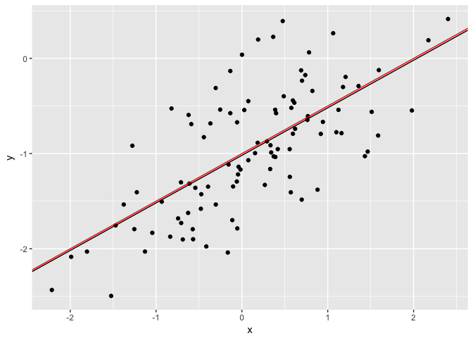<!-- -->


(g) Now fit a polynomial regression model that predicts y using x
and x2. Is there evidence that the quadratic term improves the
model fit? Explain your answer.


```r
y <- -1 + 0.5*x + eps
fit13g <- lm(y ~ poly(x,2)) #lm(y ~ x + I(x^2))
summary(fit13g)
```

```
## 
## Call:
## lm(formula = y ~ poly(x, 2))
## 
## Residuals:
##      Min       1Q   Median       3Q      Max 
## -0.98252 -0.31270 -0.06441  0.29014  1.13500 
## 
## Coefficients:
##             Estimate Std. Error t value Pr(>|t|)    
## (Intercept)  -0.9645     0.0479 -20.134  < 2e-16 ***
## poly(x, 2)1   4.4638     0.4790   9.319 3.97e-15 ***
## poly(x, 2)2  -0.6720     0.4790  -1.403    0.164    
## ---
## Signif. codes:  0 '***' 0.001 '**' 0.01 '*' 0.05 '.' 0.1 ' ' 1
## 
## Residual standard error: 0.479 on 97 degrees of freedom
## Multiple R-squared:  0.4779,	Adjusted R-squared:  0.4672 
## F-statistic:  44.4 on 2 and 97 DF,  p-value: 2.038e-14
```


```r
anova(fit13e, fit13g)
```

```
## Analysis of Variance Table
## 
## Model 1: y ~ x
## Model 2: y ~ poly(x, 2)
##   Res.Df    RSS Df Sum of Sq      F Pr(>F)
## 1     98 22.709                           
## 2     97 22.257  1   0.45163 1.9682 0.1638
```
These models are not different

(h) Repeat (a)–(f) after modifying the data generation process in
such a way that there is less noise in the data. The model (3.39)
should remain the same. You can do this by decreasing the variance
of the normal distribution used to generate the error term
$\epsilon$ in (b). Describe your results.


```r
eps_h <- rnorm(1:100, mean=0, sd=1e-2)
y <- -1 + 0.5*x + eps_h
fit13h <- lm(y~x)
summary(fit13h)
```

```
## 
## Call:
## lm(formula = y ~ x)
## 
## Residuals:
##        Min         1Q     Median         3Q        Max 
## -0.0291411 -0.0048230 -0.0004533  0.0064924  0.0264157 
## 
## Coefficients:
##              Estimate Std. Error t value Pr(>|t|)    
## (Intercept) -0.999726   0.001047  -954.8   <2e-16 ***
## x            0.500212   0.001163   430.1   <2e-16 ***
## ---
## Signif. codes:  0 '***' 0.001 '**' 0.01 '*' 0.05 '.' 0.1 ' ' 1
## 
## Residual standard error: 0.01039 on 98 degrees of freedom
## Multiple R-squared:  0.9995,	Adjusted R-squared:  0.9995 
## F-statistic: 1.85e+05 on 1 and 98 DF,  p-value: < 2.2e-16
```


```r
df <- data.frame(x=x, y=y)
df %>% ggplot(aes(x,y)) + geom_point() +
  geom_abline(intercept = coef(fit13h)[1], slope = coef(fit13h)[2])
```

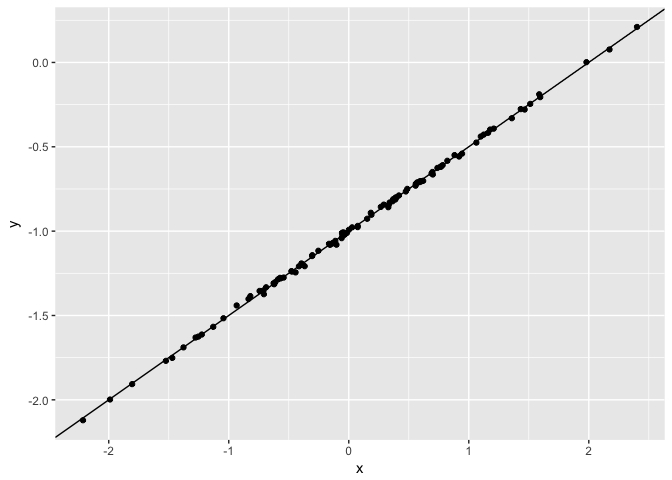<!-- -->

Small error means that my model explains almost everything, if not everything.

(i) Repeat (a)–(f) after modifying the data generation process in
such a way that there is more noise in the data. The model
(3.39) should remain the same. You can do this by increasing
the variance of the normal distribution used to generate the
error term $\epsilon$ in (b). Describe your results.


```r
eps_i <- rnorm(1:100, mean=0, sd=10)
y <- -1 + 0.5*x + eps_i
fit13i <- lm(y~x)
summary(fit13i)
```

```
## 
## Call:
## lm(formula = y ~ x)
## 
## Residuals:
##      Min       1Q   Median       3Q      Max 
## -25.1626  -5.4525  -0.3776   6.7289  18.7887 
## 
## Coefficients:
##             Estimate Std. Error t value Pr(>|t|)
## (Intercept) -0.42335    1.00281  -0.422    0.674
## x           -0.05686    1.11386  -0.051    0.959
## 
## Residual standard error: 9.955 on 98 degrees of freedom
## Multiple R-squared:  2.659e-05,	Adjusted R-squared:  -0.01018 
## F-statistic: 0.002606 on 1 and 98 DF,  p-value: 0.9594
```


```r
df <- data.frame(x=x, y=y)
df %>% ggplot(aes(x,y)) + geom_point() +
  geom_abline(intercept = coef(fit13h)[1], slope = coef(fit13h)[2])
```

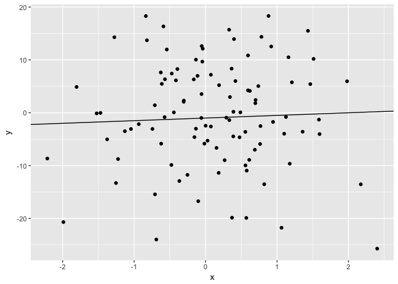<!-- -->

Large error means my model explains almost nothing.

(j) What are the confidence intervals for β0 and β1 based on the
original data set, the noisier data set, and the less noisy data
set? Comment on your results.


```r
confint(fit13e)
confint(fit13h)
confint(fit13i)
```

```
##                  2.5 %     97.5 %
## (Intercept) -1.1150804 -0.9226122
## x            0.3925794  0.6063602
##                  2.5 %     97.5 %
## (Intercept) -1.0018041 -0.9976485
## x            0.4979038  0.5025196
##                 2.5 %   97.5 %
## (Intercept) -2.413399 1.566707
## x           -2.267279 2.153558
```


## 15
**This problem involves the Boston data set, which we saw in the lab for this chapter. We will now try to predict per capita crime rate using the other variables in this data set. In other words, per capita crime rate is the response, and the other variables are the predictors.**

(a) For each predictor, fit a simple linear regression model to predict
the response. Describe your results. In which of the models is
there a statistically significant association between the predictor
and the response? Create some plots to back up your assertions.


```r
data("Boston")
names(Boston)
cat("-----------\n")
summary(fit_zn <- lm(crim ~ zn, data=Boston))
cat("-----------\n")
summary(fit_zn <- lm(crim ~ indus, data=Boston))
cat("-----------\n")
summary(fit_zn <- lm(crim ~ chas, data=Boston))
cat("-----------\n")
summary(fit_zn <- lm(crim ~ nox, data=Boston))
cat("-----------\n")
summary(fit_zn <- lm(crim ~ rm, data=Boston))
cat("-----------\n")
summary(fit_zn <- lm(crim ~ age, data=Boston))
cat("-----------\n")
summary(fit_zn <- lm(crim ~ dis, data=Boston))
cat("-----------\n")
summary(fit_zn <- lm(crim ~ rad, data=Boston))
cat("-----------\n")
summary(fit_zn <- lm(crim ~ tax, data=Boston))
cat("-----------\n")
summary(fit_zn <- lm(crim ~ ptratio, data=Boston))
cat("-----------\n")
summary(fit_zn <- lm(crim ~ black, data=Boston))
cat("-----------\n")
summary(fit_zn <- lm(crim ~ lstat, data=Boston))
```

Less clunnky with map and lapply


```r
predictors <- colnames(Boston)[-1]
lmfit <- map(predictors, function(x) lm(crim ~ get(x), data=Boston))
```


```r
lmsummaries <- lapply(lmfit,summary) #or use map()
names(lmsummaries) <- predictors
lmsummaries
```

```
## $zn
## 
## Call:
## lm(formula = crim ~ get(x), data = Boston)
## 
## Residuals:
##    Min     1Q Median     3Q    Max 
## -4.429 -4.222 -2.620  1.250 84.523 
## 
## Coefficients:
##             Estimate Std. Error t value Pr(>|t|)    
## (Intercept)  4.45369    0.41722  10.675  < 2e-16 ***
## get(x)      -0.07393    0.01609  -4.594 5.51e-06 ***
## ---
## Signif. codes:  0 '***' 0.001 '**' 0.01 '*' 0.05 '.' 0.1 ' ' 1
## 
## Residual standard error: 8.435 on 504 degrees of freedom
## Multiple R-squared:  0.04019,	Adjusted R-squared:  0.03828 
## F-statistic:  21.1 on 1 and 504 DF,  p-value: 5.506e-06
## 
## 
## $indus
## 
## Call:
## lm(formula = crim ~ get(x), data = Boston)
## 
## Residuals:
##     Min      1Q  Median      3Q     Max 
## -11.972  -2.698  -0.736   0.712  81.813 
## 
## Coefficients:
##             Estimate Std. Error t value Pr(>|t|)    
## (Intercept) -2.06374    0.66723  -3.093  0.00209 ** 
## get(x)       0.50978    0.05102   9.991  < 2e-16 ***
## ---
## Signif. codes:  0 '***' 0.001 '**' 0.01 '*' 0.05 '.' 0.1 ' ' 1
## 
## Residual standard error: 7.866 on 504 degrees of freedom
## Multiple R-squared:  0.1653,	Adjusted R-squared:  0.1637 
## F-statistic: 99.82 on 1 and 504 DF,  p-value: < 2.2e-16
## 
## 
## $chas
## 
## Call:
## lm(formula = crim ~ get(x), data = Boston)
## 
## Residuals:
##    Min     1Q Median     3Q    Max 
## -3.738 -3.661 -3.435  0.018 85.232 
## 
## Coefficients:
##             Estimate Std. Error t value Pr(>|t|)    
## (Intercept)   3.7444     0.3961   9.453   <2e-16 ***
## get(x)       -1.8928     1.5061  -1.257    0.209    
## ---
## Signif. codes:  0 '***' 0.001 '**' 0.01 '*' 0.05 '.' 0.1 ' ' 1
## 
## Residual standard error: 8.597 on 504 degrees of freedom
## Multiple R-squared:  0.003124,	Adjusted R-squared:  0.001146 
## F-statistic: 1.579 on 1 and 504 DF,  p-value: 0.2094
## 
## 
## $nox
## 
## Call:
## lm(formula = crim ~ get(x), data = Boston)
## 
## Residuals:
##     Min      1Q  Median      3Q     Max 
## -12.371  -2.738  -0.974   0.559  81.728 
## 
## Coefficients:
##             Estimate Std. Error t value Pr(>|t|)    
## (Intercept)  -13.720      1.699  -8.073 5.08e-15 ***
## get(x)        31.249      2.999  10.419  < 2e-16 ***
## ---
## Signif. codes:  0 '***' 0.001 '**' 0.01 '*' 0.05 '.' 0.1 ' ' 1
## 
## Residual standard error: 7.81 on 504 degrees of freedom
## Multiple R-squared:  0.1772,	Adjusted R-squared:  0.1756 
## F-statistic: 108.6 on 1 and 504 DF,  p-value: < 2.2e-16
## 
## 
## $rm
## 
## Call:
## lm(formula = crim ~ get(x), data = Boston)
## 
## Residuals:
##    Min     1Q Median     3Q    Max 
## -6.604 -3.952 -2.654  0.989 87.197 
## 
## Coefficients:
##             Estimate Std. Error t value Pr(>|t|)    
## (Intercept)   20.482      3.365   6.088 2.27e-09 ***
## get(x)        -2.684      0.532  -5.045 6.35e-07 ***
## ---
## Signif. codes:  0 '***' 0.001 '**' 0.01 '*' 0.05 '.' 0.1 ' ' 1
## 
## Residual standard error: 8.401 on 504 degrees of freedom
## Multiple R-squared:  0.04807,	Adjusted R-squared:  0.04618 
## F-statistic: 25.45 on 1 and 504 DF,  p-value: 6.347e-07
## 
## 
## $age
## 
## Call:
## lm(formula = crim ~ get(x), data = Boston)
## 
## Residuals:
##    Min     1Q Median     3Q    Max 
## -6.789 -4.257 -1.230  1.527 82.849 
## 
## Coefficients:
##             Estimate Std. Error t value Pr(>|t|)    
## (Intercept) -3.77791    0.94398  -4.002 7.22e-05 ***
## get(x)       0.10779    0.01274   8.463 2.85e-16 ***
## ---
## Signif. codes:  0 '***' 0.001 '**' 0.01 '*' 0.05 '.' 0.1 ' ' 1
## 
## Residual standard error: 8.057 on 504 degrees of freedom
## Multiple R-squared:  0.1244,	Adjusted R-squared:  0.1227 
## F-statistic: 71.62 on 1 and 504 DF,  p-value: 2.855e-16
## 
## 
## $dis
## 
## Call:
## lm(formula = crim ~ get(x), data = Boston)
## 
## Residuals:
##    Min     1Q Median     3Q    Max 
## -6.708 -4.134 -1.527  1.516 81.674 
## 
## Coefficients:
##             Estimate Std. Error t value Pr(>|t|)    
## (Intercept)   9.4993     0.7304  13.006   <2e-16 ***
## get(x)       -1.5509     0.1683  -9.213   <2e-16 ***
## ---
## Signif. codes:  0 '***' 0.001 '**' 0.01 '*' 0.05 '.' 0.1 ' ' 1
## 
## Residual standard error: 7.965 on 504 degrees of freedom
## Multiple R-squared:  0.1441,	Adjusted R-squared:  0.1425 
## F-statistic: 84.89 on 1 and 504 DF,  p-value: < 2.2e-16
## 
## 
## $rad
## 
## Call:
## lm(formula = crim ~ get(x), data = Boston)
## 
## Residuals:
##     Min      1Q  Median      3Q     Max 
## -10.164  -1.381  -0.141   0.660  76.433 
## 
## Coefficients:
##             Estimate Std. Error t value Pr(>|t|)    
## (Intercept) -2.28716    0.44348  -5.157 3.61e-07 ***
## get(x)       0.61791    0.03433  17.998  < 2e-16 ***
## ---
## Signif. codes:  0 '***' 0.001 '**' 0.01 '*' 0.05 '.' 0.1 ' ' 1
## 
## Residual standard error: 6.718 on 504 degrees of freedom
## Multiple R-squared:  0.3913,	Adjusted R-squared:   0.39 
## F-statistic: 323.9 on 1 and 504 DF,  p-value: < 2.2e-16
## 
## 
## $tax
## 
## Call:
## lm(formula = crim ~ get(x), data = Boston)
## 
## Residuals:
##     Min      1Q  Median      3Q     Max 
## -12.513  -2.738  -0.194   1.065  77.696 
## 
## Coefficients:
##              Estimate Std. Error t value Pr(>|t|)    
## (Intercept) -8.528369   0.815809  -10.45   <2e-16 ***
## get(x)       0.029742   0.001847   16.10   <2e-16 ***
## ---
## Signif. codes:  0 '***' 0.001 '**' 0.01 '*' 0.05 '.' 0.1 ' ' 1
## 
## Residual standard error: 6.997 on 504 degrees of freedom
## Multiple R-squared:  0.3396,	Adjusted R-squared:  0.3383 
## F-statistic: 259.2 on 1 and 504 DF,  p-value: < 2.2e-16
## 
## 
## $ptratio
## 
## Call:
## lm(formula = crim ~ get(x), data = Boston)
## 
## Residuals:
##    Min     1Q Median     3Q    Max 
## -7.654 -3.985 -1.912  1.825 83.353 
## 
## Coefficients:
##             Estimate Std. Error t value Pr(>|t|)    
## (Intercept) -17.6469     3.1473  -5.607 3.40e-08 ***
## get(x)        1.1520     0.1694   6.801 2.94e-11 ***
## ---
## Signif. codes:  0 '***' 0.001 '**' 0.01 '*' 0.05 '.' 0.1 ' ' 1
## 
## Residual standard error: 8.24 on 504 degrees of freedom
## Multiple R-squared:  0.08407,	Adjusted R-squared:  0.08225 
## F-statistic: 46.26 on 1 and 504 DF,  p-value: 2.943e-11
## 
## 
## $black
## 
## Call:
## lm(formula = crim ~ get(x), data = Boston)
## 
## Residuals:
##     Min      1Q  Median      3Q     Max 
## -13.756  -2.299  -2.095  -1.296  86.822 
## 
## Coefficients:
##              Estimate Std. Error t value Pr(>|t|)    
## (Intercept) 16.553529   1.425903  11.609   <2e-16 ***
## get(x)      -0.036280   0.003873  -9.367   <2e-16 ***
## ---
## Signif. codes:  0 '***' 0.001 '**' 0.01 '*' 0.05 '.' 0.1 ' ' 1
## 
## Residual standard error: 7.946 on 504 degrees of freedom
## Multiple R-squared:  0.1483,	Adjusted R-squared:  0.1466 
## F-statistic: 87.74 on 1 and 504 DF,  p-value: < 2.2e-16
## 
## 
## $lstat
## 
## Call:
## lm(formula = crim ~ get(x), data = Boston)
## 
## Residuals:
##     Min      1Q  Median      3Q     Max 
## -13.925  -2.822  -0.664   1.079  82.862 
## 
## Coefficients:
##             Estimate Std. Error t value Pr(>|t|)    
## (Intercept) -3.33054    0.69376  -4.801 2.09e-06 ***
## get(x)       0.54880    0.04776  11.491  < 2e-16 ***
## ---
## Signif. codes:  0 '***' 0.001 '**' 0.01 '*' 0.05 '.' 0.1 ' ' 1
## 
## Residual standard error: 7.664 on 504 degrees of freedom
## Multiple R-squared:  0.2076,	Adjusted R-squared:  0.206 
## F-statistic:   132 on 1 and 504 DF,  p-value: < 2.2e-16
## 
## 
## $medv
## 
## Call:
## lm(formula = crim ~ get(x), data = Boston)
## 
## Residuals:
##    Min     1Q Median     3Q    Max 
## -9.071 -4.022 -2.343  1.298 80.957 
## 
## Coefficients:
##             Estimate Std. Error t value Pr(>|t|)    
## (Intercept) 11.79654    0.93419   12.63   <2e-16 ***
## get(x)      -0.36316    0.03839   -9.46   <2e-16 ***
## ---
## Signif. codes:  0 '***' 0.001 '**' 0.01 '*' 0.05 '.' 0.1 ' ' 1
## 
## Residual standard error: 7.934 on 504 degrees of freedom
## Multiple R-squared:  0.1508,	Adjusted R-squared:  0.1491 
## F-statistic: 89.49 on 1 and 504 DF,  p-value: < 2.2e-16
```


```r
sapply(lmsummaries, function(x) x$coefficients["get(x)", "Pr(>|t|)"])
```

```
##           zn        indus         chas          nox           rm 
## 5.506472e-06 1.450349e-21 2.094345e-01 3.751739e-23 6.346703e-07 
##          age          dis          rad          tax      ptratio 
## 2.854869e-16 8.519949e-19 2.693844e-56 2.357127e-47 2.942922e-11 
##        black        lstat         medv 
## 2.487274e-19 2.654277e-27 1.173987e-19
```

```r
sapply(lmsummaries, function(x) x$adj.r.squared)
```

```
##         zn      indus       chas        nox         rm        age 
## 0.03828352 0.16365394 0.00114594 0.17558468 0.04618036 0.12268419 
##        dis        rad        tax    ptratio      black      lstat 
## 0.14245126 0.39004886 0.33830395 0.08225111 0.14658431 0.20601869 
##       medv 
## 0.14909551
```

A Hadley Wickham way:

arrange


function


broom


(b) Fit a multiple regression model to predict the response using
all of the predictors. Describe your results. For which predictors
can we reject the null hypothesis H0 : βj = 0?


```r
mult_fit <- lm(crim~., data=Boston)
summary(mult_fit)
```

```
## 
## Call:
## lm(formula = crim ~ ., data = Boston)
## 
## Residuals:
##    Min     1Q Median     3Q    Max 
## -9.924 -2.120 -0.353  1.019 75.051 
## 
## Coefficients:
##               Estimate Std. Error t value Pr(>|t|)    
## (Intercept)  17.033228   7.234903   2.354 0.018949 *  
## zn            0.044855   0.018734   2.394 0.017025 *  
## indus        -0.063855   0.083407  -0.766 0.444294    
## chas         -0.749134   1.180147  -0.635 0.525867    
## nox         -10.313535   5.275536  -1.955 0.051152 .  
## rm            0.430131   0.612830   0.702 0.483089    
## age           0.001452   0.017925   0.081 0.935488    
## dis          -0.987176   0.281817  -3.503 0.000502 ***
## rad           0.588209   0.088049   6.680 6.46e-11 ***
## tax          -0.003780   0.005156  -0.733 0.463793    
## ptratio      -0.271081   0.186450  -1.454 0.146611    
## black        -0.007538   0.003673  -2.052 0.040702 *  
## lstat         0.126211   0.075725   1.667 0.096208 .  
## medv         -0.198887   0.060516  -3.287 0.001087 ** 
## ---
## Signif. codes:  0 '***' 0.001 '**' 0.01 '*' 0.05 '.' 0.1 ' ' 1
## 
## Residual standard error: 6.439 on 492 degrees of freedom
## Multiple R-squared:  0.454,	Adjusted R-squared:  0.4396 
## F-statistic: 31.47 on 13 and 492 DF,  p-value: < 2.2e-16
```


