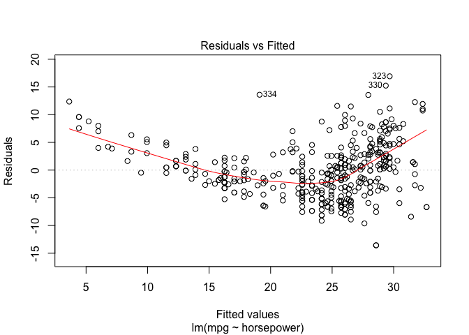
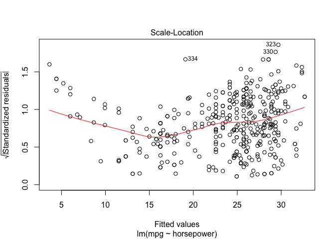
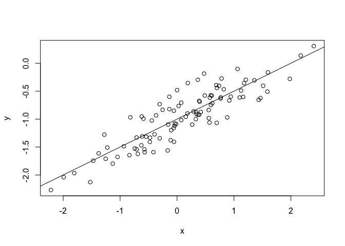

```r
library(ISLR)
library(arm)
```

```
## Loading required package: MASS
```

```
## Loading required package: Matrix
```

```
## Loading required package: lme4
```

```
## 
## arm (Version 1.9-3, built: 2016-11-21)
```

```
## Working directory is /Users/caryn/Box Sync/Projects/IntroStatisticalLearningR/Chapter3
```

```r
library(tidyverse)
```

```
## ── Attaching packages ────────────────────────────────── tidyverse 1.2.1 ──
```

```
## ✔ ggplot2 2.2.1     ✔ purrr   0.2.4
## ✔ tibble  1.3.4     ✔ dplyr   0.7.4
## ✔ tidyr   0.7.2     ✔ stringr 1.2.0
## ✔ readr   1.1.1     ✔ forcats 0.2.0
```

```
## ── Conflicts ───────────────────────────────────── tidyverse_conflicts() ──
## ✖ tidyr::expand() masks Matrix::expand()
## ✖ dplyr::filter() masks stats::filter()
## ✖ dplyr::lag()    masks stats::lag()
## ✖ dplyr::select() masks MASS::select()
```


##8. 

This question involves the use of simple linear regression on the Auto
data set.

(a) Use the lm() function to perform a simple linear regression with
mpg as the response and horsepower as the predictor. Use the
summary() function to print the results. Comment on the output.
For example:

* Is there a relationship between the predictor and the response?
* How strong is the relationship between the predictor and
the response?
* Is the relationship between the predictor and the response
positive or negative?
* What is the predicted mpg associated with a horsepower of
98? What are the associated 95% confidence and prediction
intervals?


```r
data(Auto)
head(Auto)
```

```
##   mpg cylinders displacement horsepower weight acceleration year origin
## 1  18         8          307        130   3504         12.0   70      1
## 2  15         8          350        165   3693         11.5   70      1
## 3  18         8          318        150   3436         11.0   70      1
## 4  16         8          304        150   3433         12.0   70      1
## 5  17         8          302        140   3449         10.5   70      1
## 6  15         8          429        198   4341         10.0   70      1
##                        name
## 1 chevrolet chevelle malibu
## 2         buick skylark 320
## 3        plymouth satellite
## 4             amc rebel sst
## 5               ford torino
## 6          ford galaxie 500
```


```r
Auto %>% ggplot() + geom_point(aes(x=horsepower, y=mpg))
```

<!-- -->

```r
Auto %>% ggplot() + geom_point(aes(x=horsepower, y=mpg)) + 
  facet_grid(.~year)
```

<!-- -->

Looks like year also has an effect - keep in mind for improving the model in the future.


```r
fit1 <-lm(mpg ~ horsepower, data=Auto)
display(fit1)
cat("----------\n")
summary(fit1)
cat("----------\n")
summary(fit1)$sigma
cat("----------\n")
coef(fit1)
```

```
## lm(formula = mpg ~ horsepower, data = Auto)
##             coef.est coef.se
## (Intercept) 39.94     0.72  
## horsepower  -0.16     0.01  
## ---
## n = 392, k = 2
## residual sd = 4.91, R-Squared = 0.61
## ----------
## 
## Call:
## lm(formula = mpg ~ horsepower, data = Auto)
## 
## Residuals:
##      Min       1Q   Median       3Q      Max 
## -13.5710  -3.2592  -0.3435   2.7630  16.9240 
## 
## Coefficients:
##              Estimate Std. Error t value Pr(>|t|)    
## (Intercept) 39.935861   0.717499   55.66   <2e-16 ***
## horsepower  -0.157845   0.006446  -24.49   <2e-16 ***
## ---
## Signif. codes:  0 '***' 0.001 '**' 0.01 '*' 0.05 '.' 0.1 ' ' 1
## 
## Residual standard error: 4.906 on 390 degrees of freedom
## Multiple R-squared:  0.6059,	Adjusted R-squared:  0.6049 
## F-statistic: 599.7 on 1 and 390 DF,  p-value: < 2.2e-16
## 
## ----------
## [1] 4.905757
## ----------
## (Intercept)  horsepower 
##  39.9358610  -0.1578447
```

The summaries of this fit indicate that there is an overall mean mpg of 39.9, and horsepower has a -0.15 effect on the mpg. (Increase horsepower by 1, decrease mpg by 0.15).


(b) Plot the response and the predictor. Use the abline() function
to display the least squares regression line.


```r
Auto %>% ggplot() + geom_point(aes(x=horsepower, y=mpg)) +
  geom_abline(intercept = coef(fit1)[1], slope = coef(fit1)[2]) + 
  ylim(0, 45)
```

```
## Warning: Removed 1 rows containing missing values (geom_point).
```

<!-- -->

```r
Auto %>% ggplot(aes(x=horsepower, y=mpg)) + geom_point() + geom_smooth(method="lm")
```

<!-- -->


(c) Use the plot() function to produce diagnostic plots of the least
squares regression fit. Comment on any problems you see with
the fit.


```r
plot(fit1)
```

<!-- --><!-- --><!-- --><!-- -->

In the residual plot, small and large effect have residuals that deviate from the null residual of 0, indicating non-linearity (which we can see when we plot).
Here, the Q-Q plot seems to indicate that the model has trouble with fitting the upper quantile of the data.
Some data points have a higher leverage compared to a majority of the data - but nothing is too far out of the model for concern.
Also - the range of leverage here is very small. Does that matter? As opposed to the examples in the book, which range up to 3.

##13. 

In this exercise you will create some simulated data and will fit simple
linear regression models to it. Make sure to use set.seed(1) prior to
starting part (a) to ensure consistent results.

(a) Using the rnorm() function, create a vector, x, containing 100
observations drawn from a N(0, 1) distribution. This represents
a feature, X.


```r
set.seed(1)
x <- rnorm(1:100, mean=0, sd=1)
```


(b) Using the rnorm() function, create a vector, eps, containing 100
observations drawn from a N(0, 0.25) distribution i.e. a normal
distribution with mean zero and variance 0.25.


```r
eps <- rnorm(1:100, mean=0, sd=0.25)
```


(c) Using x and eps, generate a vector y according to the model
$$Y = −1 + 0.5X + \epsilon  \space (3.39)$$

What is the length of the vector y? What are the values of β0
and β1 in this linear model?


```r
y <- -1 + 0.5*x + eps
length(y)
```

```
## [1] 100
```

Here, $\beta_0$ is -1, and $\beta_1$ is 0.5

(d) Create a scatterplot displaying the relationship between x and
y. Comment on what you observe.


```r
plot(x,y)
abline(a = -1, b = 0.5)
```

<!-- -->


(e) Fit a least squares linear model to predict y using x. Comment
on the model obtained. How do ˆ β0 and ˆ β1 compare to β0 and
β1?


```r
fit13e <- lm(y~x)
display(fit13e)
```

```
## lm(formula = y ~ x)
##             coef.est coef.se
## (Intercept) -1.01     0.02  
## x            0.50     0.03  
## ---
## n = 100, k = 2
## residual sd = 0.24, R-Squared = 0.78
```

In this linear model, the intercept is -1.02 and the coefficient for x (slope) is 0.52.
This is pretty close to the supplied model.

(f) Display the least squares line on the scatterplot obtained in (d).
Draw the population regression line on the plot, in a different
color. Use the legend() command to create an appropriate legend.


```r
df <- data.frame(x=x, y=y)
df %>% ggplot(aes(x, y)) + geom_point() +
  geom_abline(intercept = coef(fit13e)[1], slope=coef(fit13e)[2]) +
  geom_abline(intercept = -1, slope = 0.5, color="red")
```

<!-- -->


(g) Now fit a polynomial regression model that predicts y using x
and x2. Is there evidence that the quadratic term improves the
model fit? Explain your answer.

(h) Repeat (a)–(f) after modifying the data generation process in
such a way that there is less noise in the data. The model (3.39)
should remain the same. You can do this by decreasing the variance
of the normal distribution used to generate the error term
$\epsilon$ in (b). Describe your results.


```r
eps_h <- rnorm(1:100, mean=0, sd=1e-2)
y <- -1 + 0.5*x + eps_h
fit13h <- lm(y~x)
summary(fit13h)
```

```
## 
## Call:
## lm(formula = y ~ x)
## 
## Residuals:
##        Min         1Q     Median         3Q        Max 
## -0.0291411 -0.0048230 -0.0004533  0.0064924  0.0264157 
## 
## Coefficients:
##              Estimate Std. Error t value Pr(>|t|)    
## (Intercept) -0.999726   0.001047  -954.8   <2e-16 ***
## x            0.500212   0.001163   430.1   <2e-16 ***
## ---
## Signif. codes:  0 '***' 0.001 '**' 0.01 '*' 0.05 '.' 0.1 ' ' 1
## 
## Residual standard error: 0.01039 on 98 degrees of freedom
## Multiple R-squared:  0.9995,	Adjusted R-squared:  0.9995 
## F-statistic: 1.85e+05 on 1 and 98 DF,  p-value: < 2.2e-16
```


```r
df <- data.frame(x=x, y=y)
df %>% ggplot(aes(x,y)) + geom_point() +
  geom_abline(intercept = coef(fit13h)[1], slope = coef(fit13h)[2])
```

<!-- -->

Small error means that my model explains almost everything, if not everything.

(i) Repeat (a)–(f) after modifying the data generation process in
such a way that there is more noise in the data. The model
(3.39) should remain the same. You can do this by increasing
the variance of the normal distribution used to generate the
error term $\epsilon$ in (b). Describe your results.


```r
eps_i <- rnorm(1:100, mean=0, sd=10)
y <- -1 + 0.5*x + eps_i
fit13i <- lm(y~x)
summary(fit13i)
```

```
## 
## Call:
## lm(formula = y ~ x)
## 
## Residuals:
##      Min       1Q   Median       3Q      Max 
## -25.1626  -5.4525  -0.3776   6.7289  18.7887 
## 
## Coefficients:
##             Estimate Std. Error t value Pr(>|t|)
## (Intercept) -0.42335    1.00281  -0.422    0.674
## x           -0.05686    1.11386  -0.051    0.959
## 
## Residual standard error: 9.955 on 98 degrees of freedom
## Multiple R-squared:  2.659e-05,	Adjusted R-squared:  -0.01018 
## F-statistic: 0.002606 on 1 and 98 DF,  p-value: 0.9594
```


```r
df <- data.frame(x=x, y=y)
df %>% ggplot(aes(x,y)) + geom_point() +
  geom_abline(intercept = coef(fit13h)[1], slope = coef(fit13h)[2])
```

<!-- -->

Large error means my model explains almost nothing.

(j) What are the confidence intervals for β0 and β1 based on the
original data set, the noisier data set, and the less noisy data
set? Comment on your results.


```r
confint(fit13e)
confint(fit13h)
confint(fit13i)
```

```
##                  2.5 %     97.5 %
## (Intercept) -1.0575402 -0.9613061
## x            0.4462897  0.5531801
##                  2.5 %     97.5 %
## (Intercept) -1.0018041 -0.9976485
## x            0.4979038  0.5025196
##                 2.5 %   97.5 %
## (Intercept) -2.413399 1.566707
## x           -2.267279 2.153558
```


## 15
This problem involves the Boston data set, which we saw in the lab
for this chapter. We will now try to predict per capita crime rate
using the other variables in this data set. In other words, per capita
crime rate is the response, and the other variables are the predictors.

(a) For each predictor, fit a simple linear regression model to predict
the response. Describe your results. In which of the models is
there a statistically significant association between the predictor
and the response? Create some plots to back up your assertions.


```r
data("Boston")
names(Boston)
cat("-----------\n")
summary(fit_zn <- lm(crim ~ zn, data=Boston))
cat("-----------\n")
summary(fit_zn <- lm(crim ~ indus, data=Boston))
cat("-----------\n")
summary(fit_zn <- lm(crim ~ chas, data=Boston))
cat("-----------\n")
summary(fit_zn <- lm(crim ~ nox, data=Boston))
cat("-----------\n")
summary(fit_zn <- lm(crim ~ rm, data=Boston))
cat("-----------\n")
summary(fit_zn <- lm(crim ~ age, data=Boston))
cat("-----------\n")
summary(fit_zn <- lm(crim ~ dis, data=Boston))
cat("-----------\n")
summary(fit_zn <- lm(crim ~ rad, data=Boston))
cat("-----------\n")
summary(fit_zn <- lm(crim ~ tax, data=Boston))
cat("-----------\n")
summary(fit_zn <- lm(crim ~ ptratio, data=Boston))
cat("-----------\n")
summary(fit_zn <- lm(crim ~ black, data=Boston))
cat("-----------\n")
summary(fit_zn <- lm(crim ~ lstat, data=Boston))
```

```
##  [1] "crim"    "zn"      "indus"   "chas"    "nox"     "rm"      "age"    
##  [8] "dis"     "rad"     "tax"     "ptratio" "black"   "lstat"   "medv"   
## -----------
## 
## Call:
## lm(formula = crim ~ zn, data = Boston)
## 
## Residuals:
##    Min     1Q Median     3Q    Max 
## -4.429 -4.222 -2.620  1.250 84.523 
## 
## Coefficients:
##             Estimate Std. Error t value Pr(>|t|)    
## (Intercept)  4.45369    0.41722  10.675  < 2e-16 ***
## zn          -0.07393    0.01609  -4.594 5.51e-06 ***
## ---
## Signif. codes:  0 '***' 0.001 '**' 0.01 '*' 0.05 '.' 0.1 ' ' 1
## 
## Residual standard error: 8.435 on 504 degrees of freedom
## Multiple R-squared:  0.04019,	Adjusted R-squared:  0.03828 
## F-statistic:  21.1 on 1 and 504 DF,  p-value: 5.506e-06
## 
## -----------
## 
## Call:
## lm(formula = crim ~ indus, data = Boston)
## 
## Residuals:
##     Min      1Q  Median      3Q     Max 
## -11.972  -2.698  -0.736   0.712  81.813 
## 
## Coefficients:
##             Estimate Std. Error t value Pr(>|t|)    
## (Intercept) -2.06374    0.66723  -3.093  0.00209 ** 
## indus        0.50978    0.05102   9.991  < 2e-16 ***
## ---
## Signif. codes:  0 '***' 0.001 '**' 0.01 '*' 0.05 '.' 0.1 ' ' 1
## 
## Residual standard error: 7.866 on 504 degrees of freedom
## Multiple R-squared:  0.1653,	Adjusted R-squared:  0.1637 
## F-statistic: 99.82 on 1 and 504 DF,  p-value: < 2.2e-16
## 
## -----------
## 
## Call:
## lm(formula = crim ~ chas, data = Boston)
## 
## Residuals:
##    Min     1Q Median     3Q    Max 
## -3.738 -3.661 -3.435  0.018 85.232 
## 
## Coefficients:
##             Estimate Std. Error t value Pr(>|t|)    
## (Intercept)   3.7444     0.3961   9.453   <2e-16 ***
## chas         -1.8928     1.5061  -1.257    0.209    
## ---
## Signif. codes:  0 '***' 0.001 '**' 0.01 '*' 0.05 '.' 0.1 ' ' 1
## 
## Residual standard error: 8.597 on 504 degrees of freedom
## Multiple R-squared:  0.003124,	Adjusted R-squared:  0.001146 
## F-statistic: 1.579 on 1 and 504 DF,  p-value: 0.2094
## 
## -----------
## 
## Call:
## lm(formula = crim ~ nox, data = Boston)
## 
## Residuals:
##     Min      1Q  Median      3Q     Max 
## -12.371  -2.738  -0.974   0.559  81.728 
## 
## Coefficients:
##             Estimate Std. Error t value Pr(>|t|)    
## (Intercept)  -13.720      1.699  -8.073 5.08e-15 ***
## nox           31.249      2.999  10.419  < 2e-16 ***
## ---
## Signif. codes:  0 '***' 0.001 '**' 0.01 '*' 0.05 '.' 0.1 ' ' 1
## 
## Residual standard error: 7.81 on 504 degrees of freedom
## Multiple R-squared:  0.1772,	Adjusted R-squared:  0.1756 
## F-statistic: 108.6 on 1 and 504 DF,  p-value: < 2.2e-16
## 
## -----------
## 
## Call:
## lm(formula = crim ~ rm, data = Boston)
## 
## Residuals:
##    Min     1Q Median     3Q    Max 
## -6.604 -3.952 -2.654  0.989 87.197 
## 
## Coefficients:
##             Estimate Std. Error t value Pr(>|t|)    
## (Intercept)   20.482      3.365   6.088 2.27e-09 ***
## rm            -2.684      0.532  -5.045 6.35e-07 ***
## ---
## Signif. codes:  0 '***' 0.001 '**' 0.01 '*' 0.05 '.' 0.1 ' ' 1
## 
## Residual standard error: 8.401 on 504 degrees of freedom
## Multiple R-squared:  0.04807,	Adjusted R-squared:  0.04618 
## F-statistic: 25.45 on 1 and 504 DF,  p-value: 6.347e-07
## 
## -----------
## 
## Call:
## lm(formula = crim ~ age, data = Boston)
## 
## Residuals:
##    Min     1Q Median     3Q    Max 
## -6.789 -4.257 -1.230  1.527 82.849 
## 
## Coefficients:
##             Estimate Std. Error t value Pr(>|t|)    
## (Intercept) -3.77791    0.94398  -4.002 7.22e-05 ***
## age          0.10779    0.01274   8.463 2.85e-16 ***
## ---
## Signif. codes:  0 '***' 0.001 '**' 0.01 '*' 0.05 '.' 0.1 ' ' 1
## 
## Residual standard error: 8.057 on 504 degrees of freedom
## Multiple R-squared:  0.1244,	Adjusted R-squared:  0.1227 
## F-statistic: 71.62 on 1 and 504 DF,  p-value: 2.855e-16
## 
## -----------
## 
## Call:
## lm(formula = crim ~ dis, data = Boston)
## 
## Residuals:
##    Min     1Q Median     3Q    Max 
## -6.708 -4.134 -1.527  1.516 81.674 
## 
## Coefficients:
##             Estimate Std. Error t value Pr(>|t|)    
## (Intercept)   9.4993     0.7304  13.006   <2e-16 ***
## dis          -1.5509     0.1683  -9.213   <2e-16 ***
## ---
## Signif. codes:  0 '***' 0.001 '**' 0.01 '*' 0.05 '.' 0.1 ' ' 1
## 
## Residual standard error: 7.965 on 504 degrees of freedom
## Multiple R-squared:  0.1441,	Adjusted R-squared:  0.1425 
## F-statistic: 84.89 on 1 and 504 DF,  p-value: < 2.2e-16
## 
## -----------
## 
## Call:
## lm(formula = crim ~ rad, data = Boston)
## 
## Residuals:
##     Min      1Q  Median      3Q     Max 
## -10.164  -1.381  -0.141   0.660  76.433 
## 
## Coefficients:
##             Estimate Std. Error t value Pr(>|t|)    
## (Intercept) -2.28716    0.44348  -5.157 3.61e-07 ***
## rad          0.61791    0.03433  17.998  < 2e-16 ***
## ---
## Signif. codes:  0 '***' 0.001 '**' 0.01 '*' 0.05 '.' 0.1 ' ' 1
## 
## Residual standard error: 6.718 on 504 degrees of freedom
## Multiple R-squared:  0.3913,	Adjusted R-squared:   0.39 
## F-statistic: 323.9 on 1 and 504 DF,  p-value: < 2.2e-16
## 
## -----------
## 
## Call:
## lm(formula = crim ~ tax, data = Boston)
## 
## Residuals:
##     Min      1Q  Median      3Q     Max 
## -12.513  -2.738  -0.194   1.065  77.696 
## 
## Coefficients:
##              Estimate Std. Error t value Pr(>|t|)    
## (Intercept) -8.528369   0.815809  -10.45   <2e-16 ***
## tax          0.029742   0.001847   16.10   <2e-16 ***
## ---
## Signif. codes:  0 '***' 0.001 '**' 0.01 '*' 0.05 '.' 0.1 ' ' 1
## 
## Residual standard error: 6.997 on 504 degrees of freedom
## Multiple R-squared:  0.3396,	Adjusted R-squared:  0.3383 
## F-statistic: 259.2 on 1 and 504 DF,  p-value: < 2.2e-16
## 
## -----------
## 
## Call:
## lm(formula = crim ~ ptratio, data = Boston)
## 
## Residuals:
##    Min     1Q Median     3Q    Max 
## -7.654 -3.985 -1.912  1.825 83.353 
## 
## Coefficients:
##             Estimate Std. Error t value Pr(>|t|)    
## (Intercept) -17.6469     3.1473  -5.607 3.40e-08 ***
## ptratio       1.1520     0.1694   6.801 2.94e-11 ***
## ---
## Signif. codes:  0 '***' 0.001 '**' 0.01 '*' 0.05 '.' 0.1 ' ' 1
## 
## Residual standard error: 8.24 on 504 degrees of freedom
## Multiple R-squared:  0.08407,	Adjusted R-squared:  0.08225 
## F-statistic: 46.26 on 1 and 504 DF,  p-value: 2.943e-11
## 
## -----------
## 
## Call:
## lm(formula = crim ~ black, data = Boston)
## 
## Residuals:
##     Min      1Q  Median      3Q     Max 
## -13.756  -2.299  -2.095  -1.296  86.822 
## 
## Coefficients:
##              Estimate Std. Error t value Pr(>|t|)    
## (Intercept) 16.553529   1.425903  11.609   <2e-16 ***
## black       -0.036280   0.003873  -9.367   <2e-16 ***
## ---
## Signif. codes:  0 '***' 0.001 '**' 0.01 '*' 0.05 '.' 0.1 ' ' 1
## 
## Residual standard error: 7.946 on 504 degrees of freedom
## Multiple R-squared:  0.1483,	Adjusted R-squared:  0.1466 
## F-statistic: 87.74 on 1 and 504 DF,  p-value: < 2.2e-16
## 
## -----------
## 
## Call:
## lm(formula = crim ~ lstat, data = Boston)
## 
## Residuals:
##     Min      1Q  Median      3Q     Max 
## -13.925  -2.822  -0.664   1.079  82.862 
## 
## Coefficients:
##             Estimate Std. Error t value Pr(>|t|)    
## (Intercept) -3.33054    0.69376  -4.801 2.09e-06 ***
## lstat        0.54880    0.04776  11.491  < 2e-16 ***
## ---
## Signif. codes:  0 '***' 0.001 '**' 0.01 '*' 0.05 '.' 0.1 ' ' 1
## 
## Residual standard error: 7.664 on 504 degrees of freedom
## Multiple R-squared:  0.2076,	Adjusted R-squared:  0.206 
## F-statistic:   132 on 1 and 504 DF,  p-value: < 2.2e-16
```


(b) Fit a multiple regression model to predict the response using
all of the predictors. Describe your results. For which predictors
can we reject the null hypothesis H0 : βj = 0?


```r
mult_fit <- lm(crim~., data=Boston)
summary(mult_fit)
```

```
## 
## Call:
## lm(formula = crim ~ ., data = Boston)
## 
## Residuals:
##    Min     1Q Median     3Q    Max 
## -9.924 -2.120 -0.353  1.019 75.051 
## 
## Coefficients:
##               Estimate Std. Error t value Pr(>|t|)    
## (Intercept)  17.033228   7.234903   2.354 0.018949 *  
## zn            0.044855   0.018734   2.394 0.017025 *  
## indus        -0.063855   0.083407  -0.766 0.444294    
## chas         -0.749134   1.180147  -0.635 0.525867    
## nox         -10.313535   5.275536  -1.955 0.051152 .  
## rm            0.430131   0.612830   0.702 0.483089    
## age           0.001452   0.017925   0.081 0.935488    
## dis          -0.987176   0.281817  -3.503 0.000502 ***
## rad           0.588209   0.088049   6.680 6.46e-11 ***
## tax          -0.003780   0.005156  -0.733 0.463793    
## ptratio      -0.271081   0.186450  -1.454 0.146611    
## black        -0.007538   0.003673  -2.052 0.040702 *  
## lstat         0.126211   0.075725   1.667 0.096208 .  
## medv         -0.198887   0.060516  -3.287 0.001087 ** 
## ---
## Signif. codes:  0 '***' 0.001 '**' 0.01 '*' 0.05 '.' 0.1 ' ' 1
## 
## Residual standard error: 6.439 on 492 degrees of freedom
## Multiple R-squared:  0.454,	Adjusted R-squared:  0.4396 
## F-statistic: 31.47 on 13 and 492 DF,  p-value: < 2.2e-16
```

